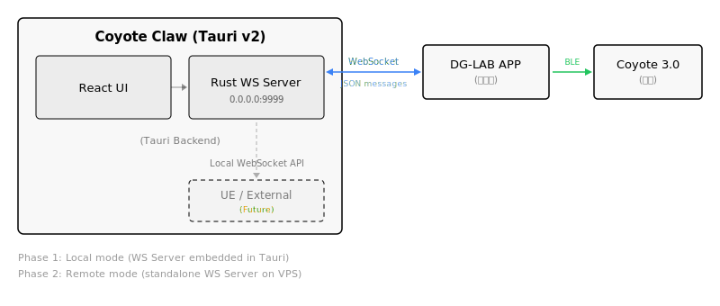
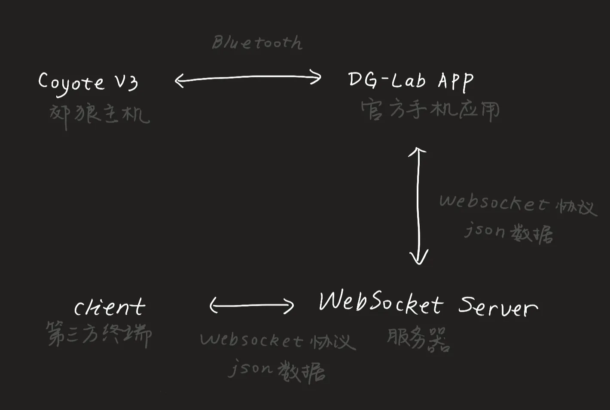

# Coyote Claw 郊狼爪爪

> DG-LAB Coyote 3.0 第三方控制器

Coyote Claw 是一个开源的 DG-LAB 郊狼 3.0 电刺激设备第三方控制器。基于 Tauri v2 构建，内嵌 WebSocket 服务器，无需额外部署后端。

## 架构概览





**工作流程：**

1. 打开 Coyote Claw，自动启动本地 WebSocket 服务器 (端口 9999)
2. 用 DG-LAB 官方 APP 扫描界面上的二维码
3. APP 通过 WebSocket 连接到本地服务器，完成配对
4. 在 Coyote Claw 上控制强度和波形

## 功能

- **二维码配对** — 自动检测局域网 IP，生成 QR code，APP 扫码即连
- **强度控制** — A/B 双通道独立调节 (0-200)
- **波形发送** — 预设波形 (呼吸、潮汐、心跳、持续) 或自定义数据
- **实时反馈** — APP 回传强度和按钮状态

## 技术栈

| 组件 | 技术 |
|------|------|
| 桌面应用 | Tauri v2 |
| 前端 | React + TypeScript + TailwindCSS v4 |
| WS 服务器 | Rust (tokio-tungstenite) |
| 协议 | DG-LAB Socket v2 |

## 下载

前往 [GitHub Releases](https://github.com/qiekn/coyote-claw/releases) 下载最新版本。

## 开发

```bash
pnpm install
pnpm tauri dev
```

## 相关页面

- [架构](project.md) — WebSocket 连接流程和协议细节
- [波形数据](json.md) — 波形 HEX 编码格式详解
