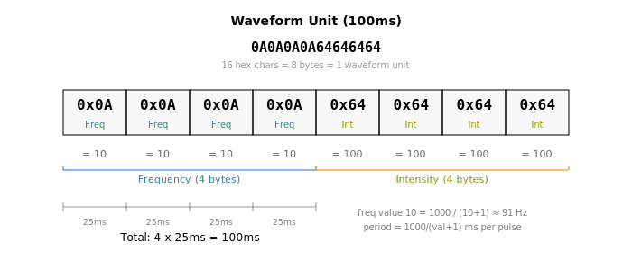
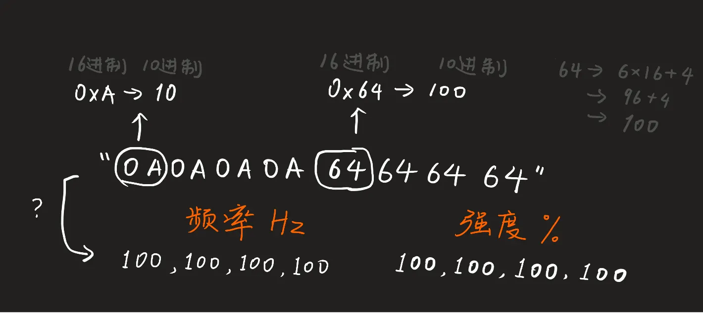
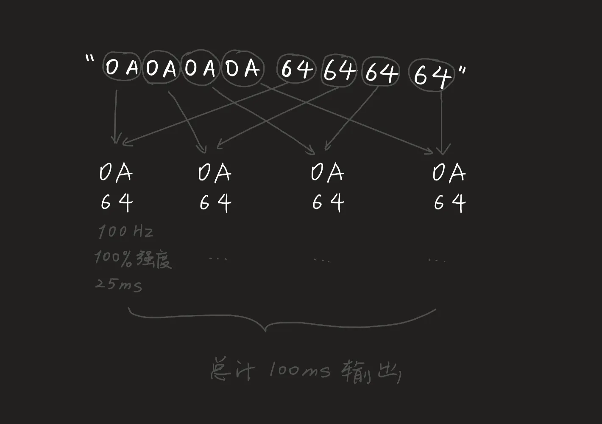
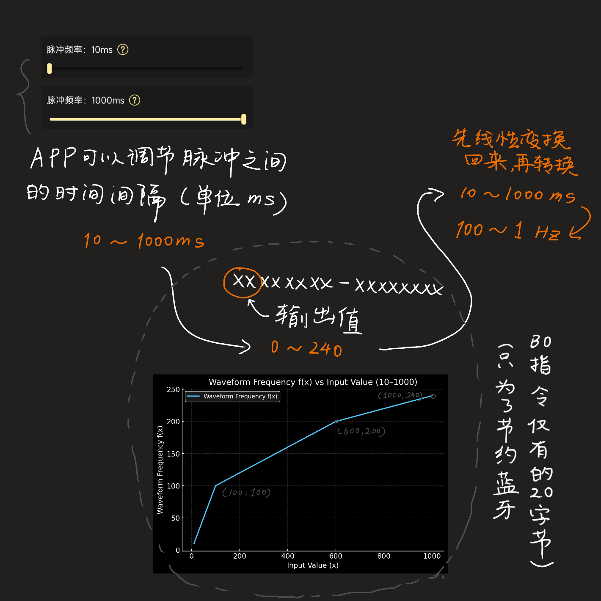

# 波形数据格式

## 波形单元结构

每个波形单元 = 8 字节 HEX 字符串 = 100ms 电流输出 (4 x 25ms)







```
[FF]  [FF]  [FF]  [FF]  [II]  [II]  [II]  [II]
频率  频率  频率  频率  强度  强度  强度  强度
25ms  25ms  25ms  25ms  25ms  25ms  25ms  25ms
```

- **前 4 字节**: 频率值，有效范围 `10~240`
    - 0~30 Hz 偏低频，有冲击感
    - \>100 Hz 偏高频，有刺感
- **后 4 字节**: 强度百分比，有效范围 `0~100`
    - 如果任何一个强度值 >100，该通道的整个 100ms 被禁用

!!! tip "实际体验"
    100ms 对应 DG-LAB APP 脉冲元形状中的一个小竖条。虽然技术上可以控制到 25ms 间隔的变化，但人体感知不明显。官方波形中 4 组数据通常是一样的。

## WebSocket 波形消息

服务器发给 APP 的波形 JSON:

```json
{
  "type": "msg",
  "clientId": "xxxx-xxxx-xxxx",
  "targetId": "xxxx-xxxx-xxxx",
  "message": "pulse-A:[\"0A0A0A0A64646464\",\"0A0A0A0A32323232\"]"
}
```

| 字段 | 说明 |
| :- | :- |
| `pulse-A` / `pulse-B` | 指定作用通道 |
| HEX 数组 | 每条最多 100 个单元 (10 秒) |
| APP 队列 | 最大 500 个单元 (50 秒) |

## 示例: 呼吸波形

DG-LAB APP 默认呼吸波形 (12 个单元 = 1.2 秒一个周期):

```
0A0A0A0A00000000  freq=10Hz, 强度=0%    ← 静默
0A0A0A0A14141414  freq=10Hz, 强度=20%   ← 渐强
0A0A0A0A28282828  freq=10Hz, 强度=40%
0A0A0A0A3C3C3C3C  freq=10Hz, 强度=60%
0A0A0A0A50505050  freq=10Hz, 强度=80%
0A0A0A0A64646464  freq=10Hz, 强度=100%  ← 最强
0A0A0A0A64646464  freq=10Hz, 强度=100%
0A0A0A0A64646464  freq=10Hz, 强度=100%
0A0A0A0A00000000  freq=10Hz, 强度=0%    ← 渐弱
0A0A0A0A00000000  freq=10Hz, 强度=0%
0A0A0A0A00000000  freq=10Hz, 强度=0%
0A0A0A0A00000000  freq=10Hz, 强度=0%    ← 静默
```

### 单元拆解

以 `0A0A0A0A64646464` 为例:

| 字节 | HEX | 十进制 | 含义 |
| :- | :- | :- | :- |
| 1-4 | `0A 0A 0A 0A` | 10 10 10 10 | 频率 10Hz x4 |
| 5-8 | `64 64 64 64` | 100 100 100 100 | 强度 100% x4 |

## 频率转换

蓝牙 V3 协议中频率范围是 10-1000，需要压缩到 10-240:



| 输入范围 | 转换公式 | 输出范围 |
| :- | :- | :- |
| 10-100 | 直接使用 | 10-100 |
| 101-600 | (input - 100) / 5 + 100 | 100-200 |
| 601-1000 | (input - 600) / 10 + 200 | 200-240 |

## 设计建议

- 连续输出: 发送波形数据的速度略快于播放速度
- 停止通道: 发送 `clear-1` (A) 或 `clear-2` (B)
- 官方波形通常每个 100ms 单元内 4 组值相同
- 强度是相对值，实际体感取决于通道强度设置
