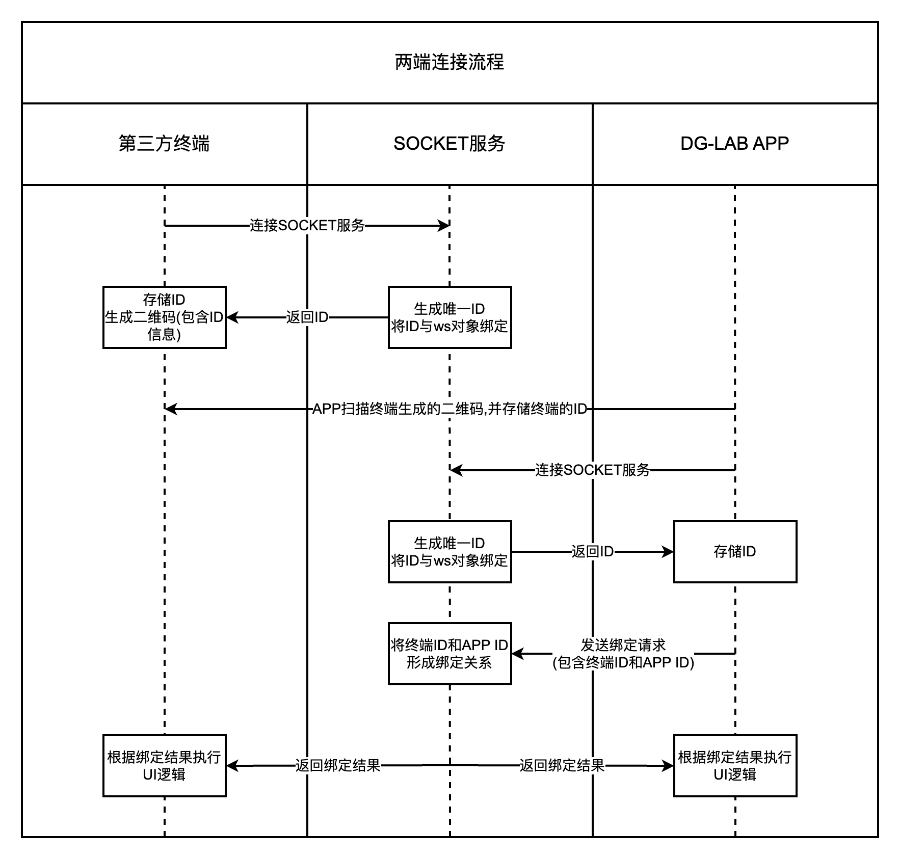
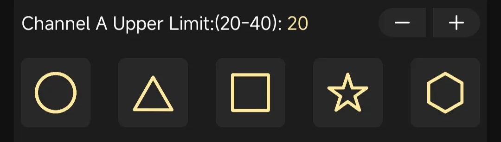

# WebSocket 架构

## 名词解释

| 名称 | 代称 | 描述 |
| :- | :- | :- |
| 第三方控制器 | `client` | Coyote Claw 桌面应用 |
| WebSocket 服务器 | `server` | 内嵌在 Tauri 中的 Rust WS 服务器 |
| 郊狼手机软件 | `target` | DG-LAB 官方 iOS/Android APP |
| 郊狼设备 | `device` | Coyote 3.0 主机硬件 |

## 连接流程





### 步骤详解

**1. 启动服务器**

Coyote Claw 启动时，Rust 后端在 `0.0.0.0:9999` 启动 WebSocket 服务器，并生成一个 UUID v4 作为 `clientId`。

**2. 生成二维码**

二维码内容格式:

```
https://www.dungeon-lab.com/app-download.php#DGLAB-SOCKET#ws://192.168.x.x:9999/CLIENT_ID
```

| 部分 | 说明 |
| :- | :- |
| `dungeon-lab.com/app-download.php` | 官方 APP 下载地址 (兜底) |
| `#DGLAB-SOCKET#` | 协议标识符 |
| `ws://192.168.x.x:9999` | 本机局域网 IP + 端口 |
| `/CLIENT_ID` | 控制器的 UUID |

**3. APP 扫码连接**

APP 扫描二维码后，提取 WebSocket 地址并发起连接。

**4. 服务器分配 targetId**

服务器收到新连接后:

- 生成新的 UUID 作为 `targetId`
- 发送初始 bind 消息: `{"type":"bind","clientId":"APP_ID","targetId":"","message":"targetId"}`

**5. APP 发送绑定请求**

APP 回复: `{"type":"bind","clientId":"...","targetId":"...","message":"DGLAB"}`

**6. 配对完成**

服务器确认后回复 `"200"`: `{"type":"bind","clientId":"...","targetId":"...","message":"200"}`

## 消息格式

WebSocket 服务器和 DG-LAB APP 之间所有消息均为 JSON:

```json
{
  "type": "xxx",
  "clientId": "xxxx-xxxx-xxxx-xxxx",
  "targetId": "xxxx-xxxx-xxxx-xxxx",
  "message": "xxx"
}
```

**字段说明：**

| 字段 | 类型 | 说明 |
| :- | :- | :- |
| `type` | string | 消息类型: `bind` / `msg` / `break` / `heartbeat` / `error` |
| `clientId` | string | 第三方控制器的 UUID |
| `targetId` | string | DG-LAB APP 的 UUID |
| `message` | string | 消息体 (始终是字符串) |

**type 说明：**

| type | 说明 |
| :- | :- |
| `bind` | 关系绑定 (连接/配对/断开) |
| `msg` | 命令消息 (强度/波形/清空/反馈) |
| `break` | 对方断开连接通知 |
| `heartbeat` | 心跳 (默认 60s 间隔) |
| `error` | 错误消息 |

最大消息长度: **1950** 字符，超出会被 APP 丢弃。

## 消息类型

### 控制器 &rarr; APP (经服务器转发)

#### 通道强度修改

`message` 格式: `strength-{通道}+{模式}+{值}`

| 参数 | 取值 | 说明 |
| :- | :- | :- |
| 通道 | `1` = A 通道, `2` = B 通道 | 选择控制哪个通道 |
| 模式 | `0` = 降低, `1` = 增加, `2` = 设置为 | 强度变化方式 |
| 值 | `0` ~ `200` | 变化量或目标值 |

**示例：**

| 操作 | message |
| :- | :- |
| A 通道强度 +5 | `strength-1+1+5` |
| B 通道强度归零 | `strength-2+2+0` |
| B 通道强度 -20 | `strength-2+0+20` |
| A 通道强度设为 35 | `strength-1+2+35` |

#### 波形操作

`message` 格式: `pulse-{通道}:[hex_data_array]`

| 参数 | 取值 | 说明 |
| :- | :- | :- |
| 通道 | `A` 或 `B` | 注意这里是字母不是数字 |

```json
{
  "type": "msg",
  "clientId": "xxxx",
  "targetId": "xxxx",
  "message": "pulse-A:[\"0A0A0A0A64646464\",\"0A0A0A0A32323232\"]"
}
```

- 数组最大 **100** 个单元 (= 10 秒)
- APP 波形队列最大 **500** 个单元 (= 50 秒)
- 每个单元格式详见 [波形数据](json.md)

#### 清空波形队列

`message` 格式: `clear-{通道}`

| 参数 | 取值 | 说明 |
| :- | :- | :- |
| 通道 | `1` = A, `2` = B | 注意这里是数字不是字母 |

### APP &rarr; 控制器

#### 强度反馈

当 APP 中的通道强度或强度上限变化时，会上报：

`message` 格式: `strength-{A强度}+{B强度}+{A上限}+{B上限}`

所有值范围 `0` ~ `200`。

#### 按钮反馈

`message` 格式: `feedback-{index}`



| index | 通道 | 按钮位置 |
| :- | :- | :- |
| 0 ~ 4 | A 通道 | 从左到右 |
| 5 ~ 9 | B 通道 | 从左到右 |

### 系统消息

| type | message | 说明 |
| :- | :- | :- |
| `bind` | `targetId` | 初始连接,服务器分配的 ID |
| `bind` | `DGLAB` | APP 请求绑定 |
| `bind` | `200` | 绑定成功 |
| `break` | `209` | 对方断开连接 |
| `heartbeat` | `200` | 心跳响应 |

## 错误码

| Code | 说明 |
| :- | :- |
| 200 | 成功 |
| 209 | 对方断开连接 |
| 400 | ID 已被其他客户端绑定 |
| 401 | 目标客户端不存在 |
| 402 | 双方未配对 |
| 403 | 消息不是有效 JSON |
| 404 | 接收方不在线 |
| 405 | 消息超过 1950 字符 |
